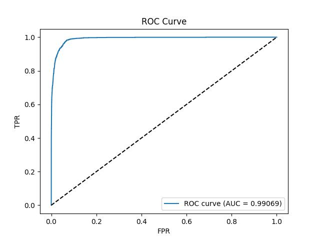
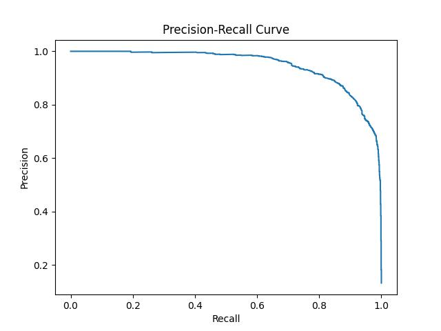
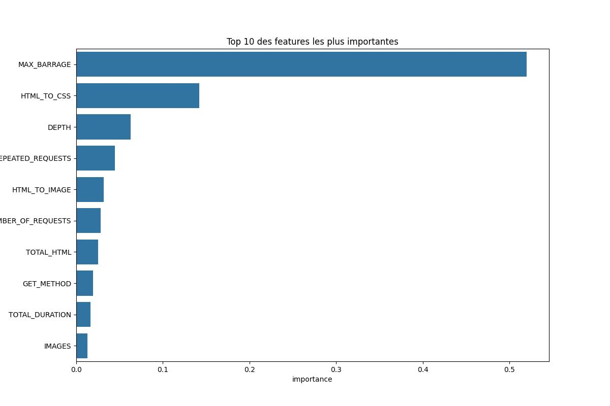

# Détection de Bots à partir de Logs HTTP avec XGBoost

Ce projet a pour objectif de construire un modèle de machine learning capable de différencier le trafic généré par des humains de celui généré par des bots, en se basant sur l'analyse de logs du moteur de recherche de la bibliothèque et centre d’information de l’Université Aristote de Thessalonique, en Grèce. (https://zenodo.org/records/3477932)

Les journaux de serveur obtenus couvrent un mois complet, du 1er au 31 mars 2018, et comprennent 4 091 155 requêtes, avec une moyenne de 131 973 requêtes par jour et un écart-type de 36 996,7 requêtes. Au total, les requêtes proviennent de 27 061 adresses IP uniques et de 3 441 chaînes user-agent distinctes.

J'ai utilisé une version traitée des journaux de logs, sous forme d’un dataset étiqueté, où les entrées sont regroupées en sessions et accompagnées de leurs caractéristiques extraites.

# Description des features du dataset initial (interprétation personnelle)

1. **ID**

Identifiant unique de la session ou de l’utilisateur.

2. **NUMBER_OF_REQUESTS**

Nombre total de requêtes effectuées dans la session.

Plus ce nombre est élevé, plus la session est active ; peut indiquer un robot si c’est très élevé.

3. **TOTAL_DURATION**

Durée totale de la session en secondes.

Permet de voir combien de temps la session a duré sur le serveur.

4. **AVERAGE_TIME**

Durée moyenne par requête.

Les bots peuvent avoir des temps très courts ou très constants.

5. **STANDARD_DEVIATION**

Écart-type du temps entre les requêtes.

Faible écart-type peut indiquer un comportement automatique (robot), très régulier.

6. **REPEATED_REQUESTS**

Fraction de requêtes répétées dans la session.

Les bots font souvent des requêtes répétitives.

7. **HTTP_RESPONSE_2XX**

Proportion de réponses 2XX (succès) dans la session.

8. **HTTP_RESPONSE_3XX**

Proportion de réponses 3XX (redirections).

9. **HTTP_RESPONSE_4XX**

Proportion de réponses 4XX (erreurs côté client).

10. **HTTP_RESPONSE_5XX**

Proportion de réponses 5XX (erreurs côté serveur).

11. **GET_METHOD**

Fraction de requêtes GET.

12. **POST_METHOD**

Fraction de requêtes POST.

13. **HEAD_METHOD**

Fraction de requêtes HEAD.

14. **OTHER_METHOD**

Fraction de requêtes avec d’autres méthodes HTTP.

15. **NIGHT**

Proportion de requêtes faites pendant la nuit.

Les robots peuvent avoir un usage uniforme 24/7 contrairement aux humains (la majorité du moins ).
ON suppose que cela est callé sur le fuseau horaire de Grèce

16. **UNASSIGNED**

Proportion de requêtes non classées ou indéterminées.

17. **IMAGES**

Proportion de requêtes pour des images.

18. **TOTAL_HTML**

Proportion de requêtes pour des fichiers HTML.

19. **HTML_TO_IMAGE**

Ratio HTML / Images.

Peut indiquer si la session charge principalement des pages ou des ressources.

20. **HTML_TO_CSS**

Ratio HTML / CSS.

21. **HTML_TO_JS**

Ratio HTML / JavaScript.

22. **WIDTH**

Nombre moyen de liens ou de branches dans le site exploré par session.

23. **DEPTH**

Profondeur maximale atteinte dans la navigation du site.

24. **STD_DEPTH**

Écart-type de la profondeur des pages visitées.

25. **CONSECUTIVE**

Fraction ou nombre de requêtes consécutives.

Indique des comportements systématiques ou automatiques.

26. **DATA**

Volume total de données transférées (octets).

27. **PPI**

Possiblement “pages per interval” ou un indicateur de fréquence de requêtes.

28. **SF_REFERRER**

Fraction de requêtes ayant un referrer spécifique.

29. **SF_FILETYPE**

Fraction de types de fichiers spécifiques (HTML, CSS, JS, images).

30. **MAX_BARRAGE**

Nombre maximum de requêtes consécutives dans un intervalle très court.

31. **PENALTY**

Score ou indicateur de comportement suspect probablement calculé par un algorithme interne.

32. **ROBOT**

Label cible : 1 si la session est identifiée comme robot, 0 si humain.

## Table des Matières
1. [Contexte du Projet](#contexte-du-projet)
2. [Set up du projet](#set-up-du-projet)
3. [Structure du Projet](#structure-du-projet)
4. [Workflow](#workflow)
5. [Résultats](#résultats)
6. [Conclusion et Pistes d'Amélioration](#conclusion-et-pistes-damélioration)

## Contexte du Projet

Les bots malveillants représentent une **menace** croissante pour les infrastructures web, notamment dans les secteurs du e-commerce et du luxe. Selon le Global Bot Security Report 2024 de l'entreprise DataDome, 95 % des bots avancés passent inaperçus, ce qui expose les sites à des risques tels que le vol de contenu, le scraping de données sensibles et des attaques par déni de service distribué (DDoS) 
De plus, 60 % des sites n'ont mis en place aucune protection contre les attaques basiques de bots.

Dans ce contexte, l'objectif de ce projet est de **développer des méthodes d'analyse permettant d'identifier et de différencier les comportements des utilisateurs humains de ceux des robots.** Une telle approche est essentielle pour protéger les ressources informatiques, préserver l'intégrité des données et optimiser l'expérience utilisateur en filtrant les interactions non humaines.

## Set up du projet

1.  **Clonez le dépôt :**
    ```bash
    git clone [https://github.com/AlbinMorisseau/bot-detection.git](https://github.com/AlbinMorisseau/bot-detection.git)
    cd bot-detection-project
    ```
2.  **Créez et activez un environnement virtuel :**
    ```bash
    python -m venv venv
    # Sur Windows
    .\venv\Scripts\activate
    # Sur MacOS/Linux
    source venv/bin/activate
    ```
3.  **Installez les dépendances :**
    ```bash
    pip install -r requirements.txt
    ```

## Structure du Projet
```
bot-detection-project/
├── data/
│   └── data.csv
├── notebooks/
│   └── EDA.ipynb
├── src/
|   ├── results/
|       ├── 10_best_features.jpg
│       ├── confusion_matrix.jpg
|       ├── PR_curve.jpg
│       └── ROC_curve.jpg
│   ├── dashboard.py
|   ├── preprocess.py
│   └── train.py
├── .gitignore
├── requirements.txt
└── README.md
```   
## Workflow

Un premier travail de Exploratory Data Analysisa été effectué dans le notebook EDA.ipynb où on a étudié notre dataset :

- Identifier la distribution de la variable cible (ROBOT),

- Détecter les colonnes redondantes, corrélées ou peu informatives,

- Analyser les valeurs manquantes et les doublons,

- Comprendre les variables les plus discriminantes entre les comportements humains et automatisés.


Le pipeline de détection de bots repose sur deux étapes principales : le prétraitement des données et l’entraînement du modèle XGBoost avec optimisation automatique via Optuna.

1. **Prétraitement des données (preprocess.py)**

Suppression de colonnes non pertinentes ou limitant la généralisation sur de futures données

Supression des colonnes avec beaucoup de valeur manquantes car les tentatives d'imputation
ont été moins efficaces (médiane, moyenne,KNN)

Imputation des valeurs manquantes numériques (par robustesse si le dataset d'entrée est modifié)

Suppression des doublons pour éviter les biais d’apprentissage.

Découpage du jeu de données en train/test (80/20), en conservant la proportion des classes.


2. **Entraînement et optimisation (train.py)**

On a choisi un modèle XGBoost qui a fait ses preuve pour la classification binaire. Il faudra par la suite tester d'autres algorithmes de Machine Learning pour voir si on peut améliorer la pipeline.

Les hyperparamètres sont automatiquement optimisés grâce à Optuna afin de maximiser le PR-AUC particulièrement adaptée aux problèmes de classes déséquilibrées.

**Hyperparamètres optimisés**

| Paramètre | Description | Impact sur le modèle |
|-----------|-------------|--------------------|
| n_estimators | Nombre total d’arbres construits par le modèle. | Un nombre trop faible peut sous-apprendre, trop élevé peut entraîner du sur-apprentissage. |
| max_depth | Profondeur maximale des arbres. | Contrôle la complexité : des arbres plus profonds capturent plus de relations mais risquent le sur-apprentissage. |
| learning_rate | Taux d’apprentissage pour la mise à jour des poids. | Plus le taux est petit, plus l’apprentissage est progressif et stable. |
| subsample | Proportion d’échantillons utilisée pour chaque arbre. | Introduit de la variance, réduit le risque de sur-apprentissage. |
| colsample_bytree | Proportion de features utilisées pour chaque arbre. | Encourage la diversité entre arbres et améliore la généralisation. |
| gamma | Gain minimal requis pour créer une nouvelle division. | Régularise le modèle en limitant les splits non significatifs. |
| lambda | Terme de régularisation L2 sur les poids. | Stabilise les coefficients et évite le sur-ajustement. |
| alpha | Terme de régularisation L1 sur les poids. | Encourage la parcimonie, favorise la sélection de variables. |
| scale_pos_weight | Poids relatif de la classe minoritaire. | Corrige le déséquilibre entre les classes (humain vs robot). |

3. **Évaluation et résultats**

Le modèle final est évalué sur le jeu de test à l’aide de plusieurs indicateurs et visualisations :

Rapport de classification (Précision, Rappel, F1-score)

Matrice de confusion

Courbes ROC et Precision-Recall

Importance des variables

Les graphiques sont enregistrés dans le dossier 'results'

## Résultats

Voici un résumé des résultats obtenus pour ce travail de détections de bots.
Ces premiers résultats vont servir de fondements pour essayer d'améliorer certains aspects par la suite.

---

### 1. Choix des Métriques

Dans le contexte de la détection de bots, **l’Accuracy (Exactitude)** n’est pas la métrique la plus fiable, car le jeu de données est **déséquilibré** (majorité de sessions humaines).  
Un modèle pourrait être précis à 95% en classant tout comme *« Humain »*, si les bots ne représentent que 5% du trafic.

Voici les métriques que nous allons privilégier:

- **Rappel (Recall)** : proportion de bots correctement identifiés  
  $$ Recall = \frac{TP}{TP + FN} $$  
  ➤ *Objectif : maximiser le rappel pour minimiser les faux négatifs (bots non détectés).*

- **Précision (Precision)** : proportion de prédictions "Robot" réellement correctes  
  $$ Precision = \frac{TP}{TP + FP} $$  
  ➤ *Objectif : maintenir une bonne précision pour éviter de bloquer des utilisateurs humains.*

- **F1-Score** et **PR AUC** (Area Under the Precision-Recall Curve) combinent ces deux aspects.  
  La **PR AUC** a été utilisée comme **métrique principale pour l’optimisation via Optuna**.

---

### 2. Optimisation des Hyperparamètres avec Optuna

Une recherche automatisée d’hyperparamètres a été réalisée avec **Optuna**, en maximisant la **PR AUC** sur l’ensemble de validation.

**Meilleur PR AUC (Validation) : 0.9488**

**Hyperparamètres optimaux :**

| Hyperparamètre | Valeur | Description |
| :--- | :--- | :--- |
| `n_estimators` | 807 | Nombre d’arbres de décision |
| `max_depth` | 9 | Profondeur maximale des arbres |
| `learning_rate` | 0.2494 | Taux d’apprentissage |
| `subsample` | 0.9803 | Fraction d’échantillons utilisée par arbre |
| `colsample_bytree` | 0.7125 | Fraction de features utilisée par arbre |
| `gamma` | 0.3269 | Seuil de perte minimale pour une division |
| `lambda (L2)` | 4.8422 | Terme de régularisation L2 |
| `alpha (L1)` | 1.2015 | Terme de régularisation L1 |

---

### 3. Résultats Finaux sur le Jeu de Test

| Classe | Précision | Rappel | F1-Score | Support |
| :--- | :---: | :---: | :---: | :---: |
| **Humain** | 0.99 | 0.95 | 0.97 | 9839 |
| **Robot** | 0.75 | 0.95 | **0.84** | 1507 |
| **Accuracy globale** |  |  | 0.95 | 11346 |

**Interprétation :**
- 🔹 **Rappel (Bots) = 95%** → excellente détection des menaces.  
- 🔸 **Précision (Bots) = 75%** → 25% de faux positifs (humains mal classés).  
  Cela reste acceptable, mais représente **l’axe principal d’amélioration**.

---

### 📉 4. Courbes de Performance

#### • Courbe ROC (Receiver Operating Characteristic)
  

**AUC = 0.99069** → excellente capacité discriminatoire.

#### • Courbe Précision–Rappel


La courbe montre un maintien élevé de la précision même pour un rappel fort, validant la robustesse du modèle.

---

### 🔍 5. Explicabilité : Importance des Caractéristiques



Le modèle identifie les **10 features les plus importantes** pour distinguer les bots des humains :

| Rang | Feature | Importance (Gain) | Interprétation |
| :---: | :--- | :---: | :--- |
| 1 | `MAX_BARRAGE` | 0.5196 | Indicateur d’agressivité (rafales de requêtes) |
| 2 | `HTML_TO_CSS` | 0.1423 | Ratio de requêtes CSS/HTML (souvent faible pour les scrapers) |
| 3 | `DEPTH` | 0.0628 | Profondeur de navigation (anormale pour bots) |
| 4 | `REPEATED_REQUESTS` | 0.0447 | Taux d’activité répétitive |
| 5 | `HTML_TO_IMAGE` | 0.0316 | Ratio images/HTML (bots ignorent souvent les images) |
| 6 | `NUMBER_OF_REQUESTS` | 0.0283 | Volume total de la session |
| 7 | `TOTAL_HTML` | 0.0253 | Nombre de fichiers HTML demandés |
| 8 | `GET_METHOD` | 0.0195 | Usage de la méthode HTTP GET |
| 9 | `TOTAL_DURATION` | 0.0163 | Durée totale de la session |
| 10 | `IMAGES` | 0.0130 | Nombre de fichiers image chargés |


**Conclusion :**  
Le modèle a appris que les **bots** se distinguent principalement par :
- une **vitesse excessive** (`MAX_BARRAGE`),  
- un **volume important de requêtes** (`NUMBER_OF_REQUESTS`),  
- et des **patterns non-humains** dans les ressources demandées (`HTML_TO_CSS`, `HTML_TO_IMAGE`).

---

## Conclusion et pistes d'améliorations

Le projet démontre qu'un modèle XGBoost bien optimisé permet de **détecter efficacement les bots** à partir de logs HTTP, avec un **rappel élevé (95%)** pour la classe bot, garantissant la capture de la majorité des activités automatisées. Une tentative d'explicabilité des features souligne que les comportements de bots se traduisent par des **rafales de requêtes**, des **patterns de navigation atypiques** et des **ratios de ressources spécifiques (images, CSS)**.

#### Limites et axes d’amélioration

- **Précision des bots (75%)** : réduire les faux positifs pour éviter de bloquer des utilisateurs légitimes, éventuellement via des techniques de rééchantillonnage ou de pondération de classes plus fine.
- **Exploration d’autres modèles** : tester des approches basées sur des réseaux de neurones ou des forêts aléatoires pour comparer la performance.
- **Détection en temps réel** : adapter le pipeline pour une application en ligne, ce qui nécessite un traitement rapide et efficace des logs entrants.
